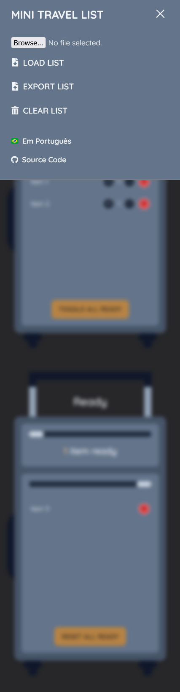

# Mini Travel List

### 🇬🇧 About this app:

A minimalist (and self-indulgent) little Progressive Web Application project built mainly for personal use, and to practice state management in React, styling with Tailwind and basic i18n with i18next. The app requires internet connection, but works entirely locally, as data is stored in the browser's local storage. It also includes options to export and import the list file in JSON format.

App workflow:

1. Add items by entering their names in the input field of the "Organize" list. This will mark the item as to be organized.
2. Click on the item to mark it as ready, which will push it to the "Ready" list.
3. Clicking on items on the "Ready" items will push them back to the "Organize" List.
4. The "Toggle all ready" button pushes all the items from the "Organize" list to the "Ready" list. Likewise, the "Reset all ready" button does the same kind of operation, but the other way around.

The logic behind how this app works was born from a minor pain point for me whenever I made my own lists for short trips. All the things I carry with me are goods I unpack to use during my stay, then stuff those back into my bag once the trip is over.

I'm aware of the many sophisticated and excellent travel packing apps out in the wild, but I wanted to take my own approach to what I consider the solution to my problem. And, of course, it's also a good excuse to practice my problem-solving and coding skills.

### 🇧🇷 Sobre o app:

Progressive Web Application de lista de viagem minimalista construída mais para fins pessoais, e também para praticar gerenciamento de estado com React, estilos com Tailwind, e o básico de i18n com i18next. O app requer conexão com a internet, mas funciona de forma totalmente local, pois os dados são armazenados no armazenamento local do navegador. E também conta com opção de importar ou exportar a lista para arquivo no formato JSON.

Workflow do app:

1. Adicione itens escrevendo o nome na caixa de texto dentro da lista "Organize". Fazendo isso, o item será adicionado na lista de itens ainda não guardados na mala.
2. Apertando em cima do nome do item nessa primeira lista irá jogar o item na segunda lista, "Ready", marcando o mesmo como pronto.
3. Da mesma forma, ao apertar nos itens na lista "Ready", eles voltam para a primeira lista, "Organize".
4. O botão "Toggle all ready" joga todos os itens da lista "Organize" para a lista "Ready". E o botão "Reset all ready" também troca todos os itens de lado, só que da lista "Ready" para a "Organize".

O app foi construído dessa forma para solucionar um pequeno problema pessoal que eu vinha tendo ao fazer minhas listas para viagens de curta duração. Praticamente tudo que eu carrego comigo são coisas que tiro da mala para uso no local, e depois coloco de volta na mala no fim da viagem.

Sei que existem vários apps excelentes e mais sofisticados voltados para esse mesmo fim, mas quis resolver meu próprio problema da minha forma. Que, claro, não deixa de ser mais uma forma de praticar como solucionar problemas com código.

## Live version

[Deployed here](https://mini-travel-list-tsm13.netlify.app/)

## Features

- Bilingual app: English and Portuguese interface — per my first user's (aka my mom) demands! 😅
- Local Storage: data is stored locally in the browser
- Option to export/import list to/from a json file
- Updatable item quantity
- Responsive layout

## Tools and technical concepts

- React
- TypeScript
- Context API + useReducer
- i18next for React
- Custom Hooks
- Tailwind CSS
